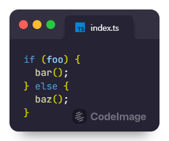
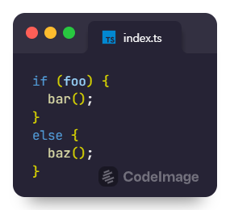
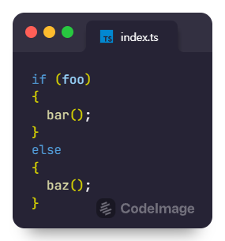

# prettier-plugin-brace-style

A Prettier plugin that can apply ESLint's [brace-style](https://eslint.org/docs/latest/rules/brace-style) rules to JavaScript and TypeScript files.

**Note**: Prettier v3 is not yet supported.

## Installation

```sh
npm install -D prettier@~2.8 prettier-plugin-brace-style
```

```sh
yarn add -D prettier@~2.8 prettier-plugin-brace-style
```

```sh
pnpm add -D prettier@~2.8 prettier-plugin-brace-style
```

## Configuration

JSON:

```json
{
  "plugins": ["prettier-plugin-brace-style"],
  "braceStyle": "1tbs"
}
```

JS:

```javascript
module.exports = {
  plugins: [require('prettier-plugin-brace-style')],
  braceStyle: '1tbs',
};
```

## Options

This plugin has only one option, `braceStyle`. Same as ESLint, you can select one of `1tbs` (default), `stroustrup`, `allman`.

<!-- prettier-ignore -->
Option&nbsp;value | Description | Example&nbsp;code
--- | --- | ---
`1tbs` | the opening brace of a block is placed on the same line as its corresponding statement or declaration. | 
`stroustrup` | the `else` statements in an `if-else` construct, as well as `catch` and `finally`, must be on its own line after the preceding closing brace. | 
`allman` | all the braces are expected to be on their own lines without any extra indentation. | 

## Limitation

Because this plugin supports babel parser and typescript parser, only one plugin can be applied for overlapping parsers when used with other plugins that support either or both parsers.

In this case, if the printer corresponding to the overlapping parser is not implemented in another plugin, you can add [prettier-plugin-merge](https://github.com/ony3000/prettier-plugin-merge) to configure it as follows.

JSON example:

```json
{
  "plugins": [
    "another-prettier-plugin-that-implements-babel-or-typescript-parser",
    "prettier-plugin-brace-style",
    "prettier-plugin-merge"
  ],
  "braceStyle": "1tbs"
}
```
