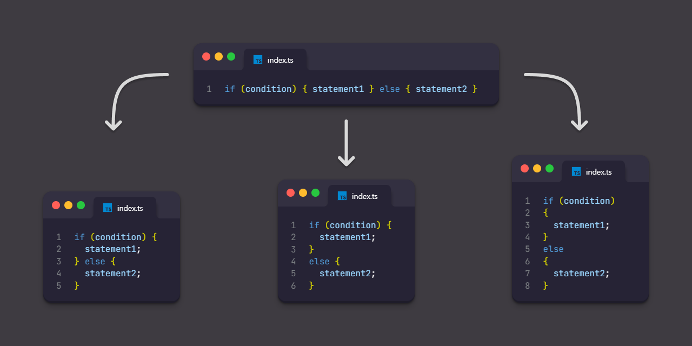

# prettier-plugin-brace-style

A Prettier plugin that can apply ESLint's [brace-style](https://eslint.org/docs/latest/rules/brace-style) rules.



## Installation

For Prettier v2:

```sh
npm install -D prettier@^2 prettier-plugin-brace-style
```

For Prettier v3:[^1]

```sh
npm install -D prettier prettier-plugin-brace-style
```

[^1]: If your version of `prettier-plugin-brace-style` is less than `0.5.0`, you will also need to install `@prettier/sync`.

## Configuration

JSON example:

```json
{
  "plugins": ["prettier-plugin-brace-style"]
}
```

JS example (CommonJS module):

```javascript
module.exports = {
  plugins: ['prettier-plugin-brace-style'],
  braceStyle: 'stroustrup',
};
```

JS example (ES module):

```javascript
export default {
  plugins: ['prettier-plugin-brace-style'],
  braceStyle: 'allman',
};
```

## Options

### Brace Style

Enforces consistent brace style for blocks. Same as ESLint, you can select one of `1tbs` (default), `stroustrup`, `allman`.

- `1tbs` example:

  ```
  if (condition) {
    statement1;
  } else {
    statement2;
  }
  ```

- `stroustrup` example:

  ```
  if (condition) {
    statement1;
  }
  else {
    statement2;
  }
  ```

- `allman` example:

  ```
  if (condition)
  {
    statement1;
  }
  else
  {
    statement2;
  }
  ```

<!-- prettier-ignore -->
Default | CLI&nbsp;Override | API&nbsp;Override
--- | --- | ---
`"1tbs"` | `--brace-style <1tbs\|stroustrup\|allman>` | `braceStyle: "<1tbs\|stroustrup\|allman>"`

## Version correlation with sibling plugins

Starting with `0.6.0`, when there is a minor release on one side, I plan to reflect that change on the other side as well if possible.


## Compatibility with other Prettier plugins

If more than one Prettier plugin can handle the text you want to format, Prettier will only use the last of those plugins.

In this case, you can configure it as follows by adding [prettier-plugin-merge](https://github.com/ony3000/prettier-plugin-merge) to apply those plugins sequentially.

JSON example:

<!-- prettier-ignore -->
```json
{
  "plugins": [
    "@trivago/prettier-plugin-sort-imports",
    "prettier-plugin-brace-style",
    "prettier-plugin-merge"
  ],
  "braceStyle": "stroustrup"
}
```
